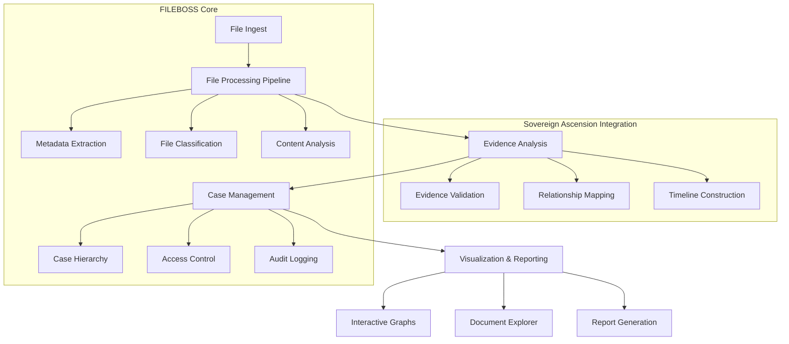

# FILEBOSS x Sovereign Ascension Protocol - Architecture

## System Overview

## Core Components

### 1. File Processing Layer
- **File Ingest Service**: Handles file uploads from multiple sources
- **Metadata Extractor**: Extracts and normalizes file metadata
- **Content Analyzer**: Performs deep content analysis and classification
- **Version Manager**: Tracks file changes and maintains history

### 2. Analysis Engine
- **Evidence Validator**: Verifies file authenticity and integrity
- **Relationship Mapper**: Discovers and tracks connections between files/cases
- **Timeline Generator**: Constructs chronological sequences of events
- **Pattern Recognition**: Identifies significant patterns across cases

### 3. Case Management
- **Hierarchical Organization**: Cases, sub-cases, and related items
- **Access Control**: Fine-grained permissions system
- **Audit System**: Tracks all actions and changes
- **Workflow Engine**: Manages case progression and tasks

### 4. Visualization & Reporting
- **Interactive Graph**: Visualizes relationships between entities
- **Document Explorer**: Navigates case files and evidence
- **Report Generator**: Creates comprehensive case reports
- **Dashboard**: Overview of case status and metrics

## Data Flow

1. **Ingest Phase**
   - Files are uploaded or discovered
   - Initial metadata extraction
   - File classification and tagging

2. **Analysis Phase**
   - Content analysis and evidence extraction
   - Relationship discovery
   - Timeline construction
   - Anomaly detection

3. **Storage Phase**
   - Structured data storage
   - Indexing for search
   - Backup and archival

4. **Presentation Phase**
   - Interactive visualization
   - Reporting
   - Alerts and notifications

## Integration Points

### Sovereign Ascension Protocol Integration
- Uses the analysis engine for deep evidence processing
- Leverages the legal reasoning capabilities
- Integrates with the visualization system for case analysis

### Cloud Services
- Secure file storage (S3/Blob Storage)
- AI/ML processing pipelines
- Cross-device synchronization

## Security Model

- End-to-end encryption for sensitive data
- Role-based access control (RBAC)
- Audit logging for all operations
- Data retention and disposal policies

## Performance Considerations

- Asynchronous processing for long-running tasks
- Caching layer for frequently accessed data
- Horizontal scaling for high-load scenarios
- Efficient indexing for quick searches

## Future Extensions

- Mobile client applications
- Voice interface for hands-free operation
- Advanced AI/ML for predictive analysis
- Blockchain integration for notarization
