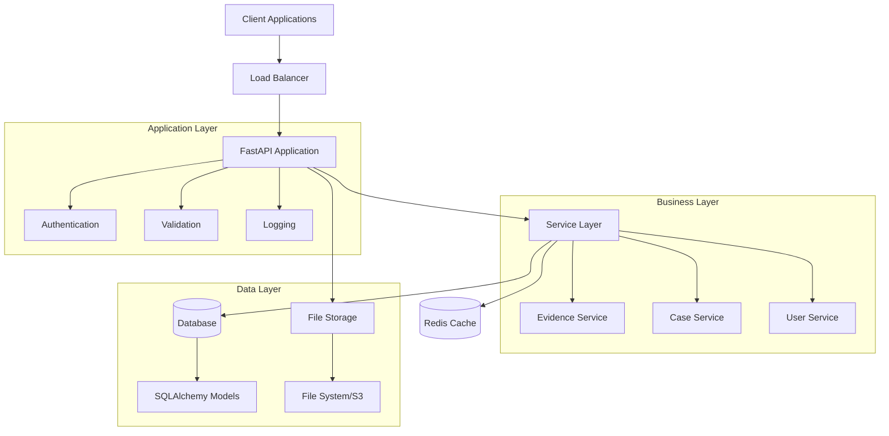
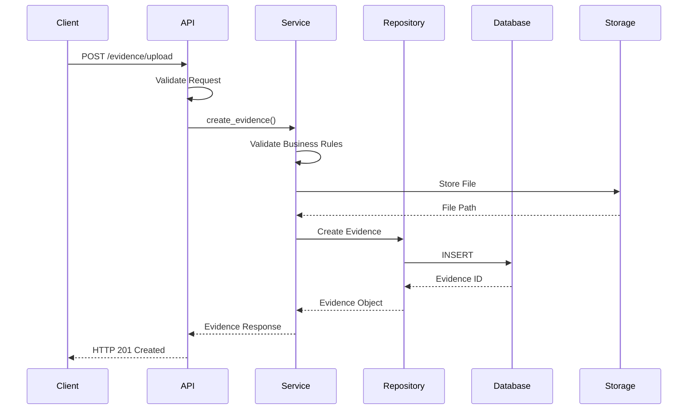
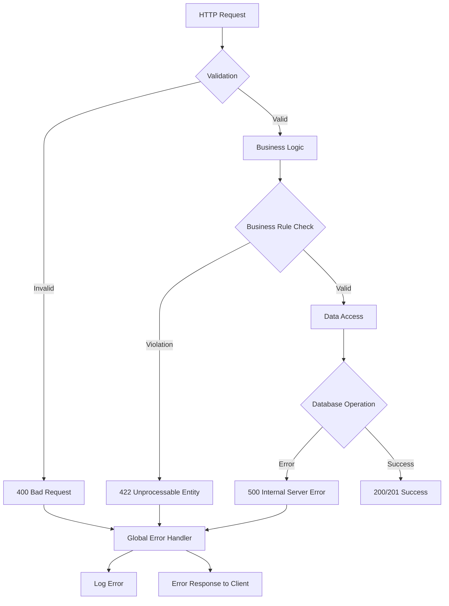
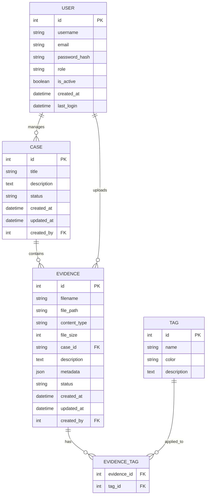
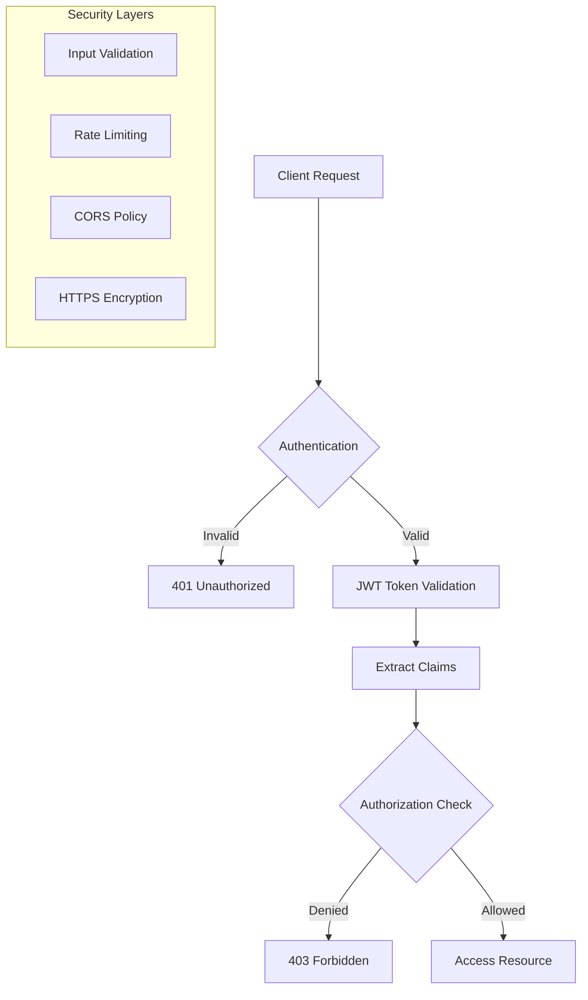
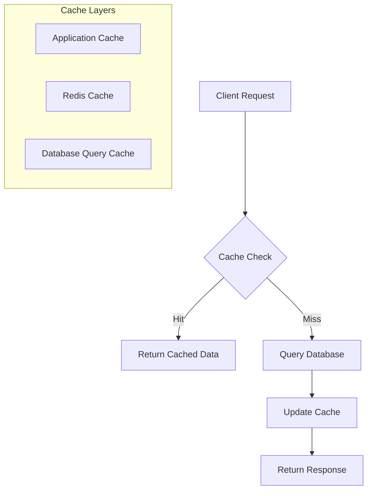
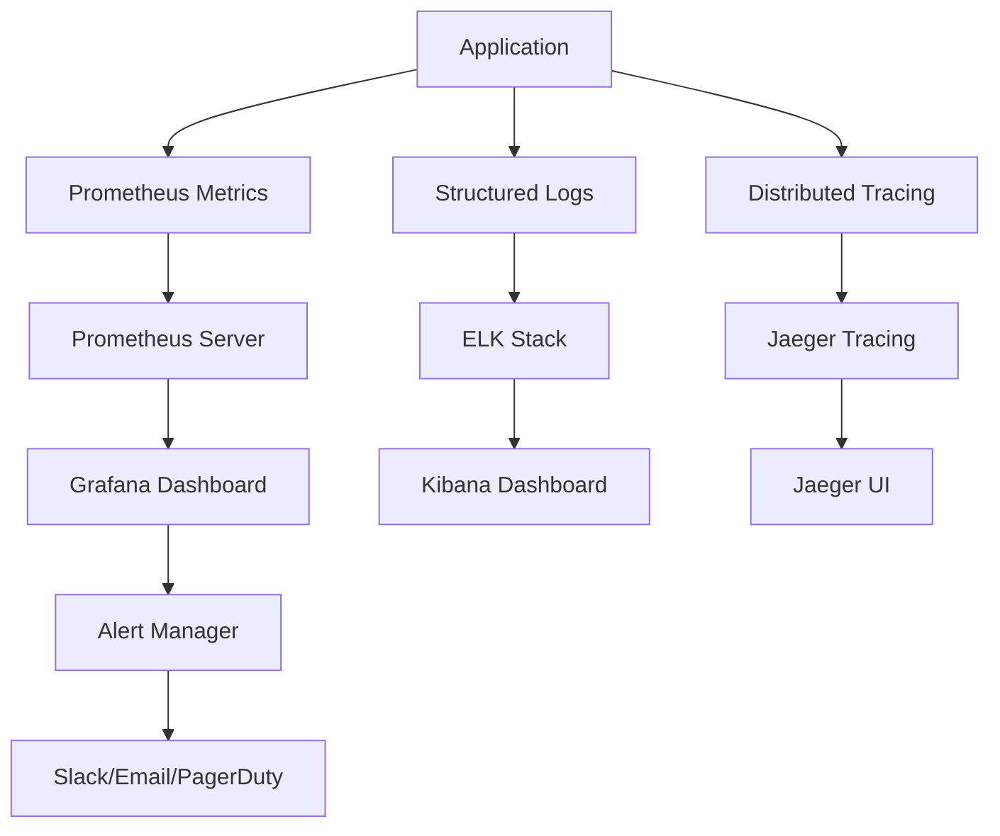
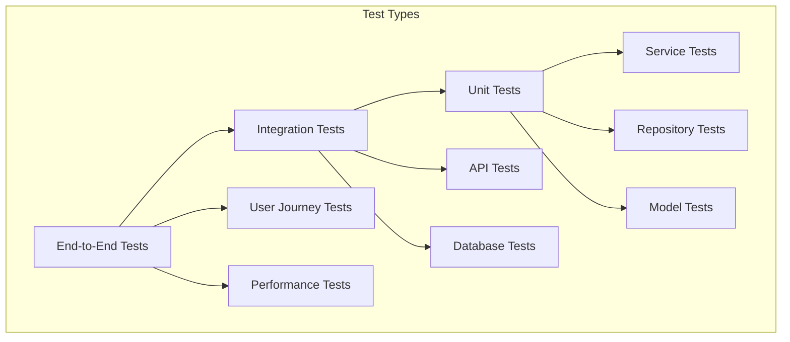

# 🏛️ Architecture Overview

Comprehensive architectural documentation for the CaseBuilder evidence management system.

## 🎯 System Overview

CaseBuilder is a modern, cloud-native evidence management system built with a microservices-ready architecture. It follows Domain-Driven Design (DDD) principles and implements Clean Architecture patterns for maintainability, scalability, and testability.

### Core Principles

- **Separation of Concerns**: Clear boundaries between layers
- **Dependency Inversion**: High-level modules don't depend on low-level modules
- **Single Responsibility**: Each component has one reason to change
- **Open/Closed Principle**: Open for extension, closed for modification
- **Interface Segregation**: Clients depend only on interfaces they use

---

## 🏗️ High-Level Architecture



---

## 📦 Component Architecture

### 1. Presentation Layer (API)

**Responsibility**: Handle HTTP requests, response formatting, and API documentation.

```python
# casebuilder/api/endpoints/evidence.py
@router.post("/upload/", response_model=EvidenceSchema)
async def upload_evidence(
    file: UploadFile = File(...),
    case_id: str = Form(...),
    evidence_service: EvidenceService = Depends(get_evidence_service)
) -> Dict[str, Any]:
    """API endpoint for evidence upload."""
    return await evidence_service.create_evidence(file, case_id)
```

**Components**:
- **Routers**: FastAPI routers for different domains
- **Dependencies**: Dependency injection for services
- **Middleware**: Cross-cutting concerns (CORS, authentication, logging)
- **Exception Handlers**: Centralized error handling

### 2. Business Logic Layer (Services)

**Responsibility**: Implement business rules, orchestrate operations, and maintain domain logic.

```python
# casebuilder/services/evidence_processing.py
class EvidenceProcessingService:
    """Business logic for evidence processing."""
    
    def __init__(self, db: AsyncSession):
        self.db = db
        self.file_service = FileStorageService()
        self.metadata_service = MetadataExtractionService()
    
    async def create_evidence(self, file: UploadFile, case_id: str) -> Evidence:
        """Process evidence creation with business rules."""
        # Validate business rules
        await self._validate_case_exists(case_id)
        await self._validate_file_constraints(file)
        
        # Extract metadata
        metadata = await self.metadata_service.extract(file)
        
        # Store file
        file_path = await self.file_service.store(file, case_id)
        
        # Create database record
        evidence = Evidence(
            filename=file.filename,
            case_id=case_id,
            file_path=file_path,
            metadata=metadata
        )
        
        self.db.add(evidence)
        await self.db.commit()
        
        return evidence
```

**Components**:
- **Domain Services**: Core business logic
- **Application Services**: Orchestrate use cases
- **Domain Events**: Publish business events
- **Specifications**: Business rule validation

### 3. Data Access Layer (Repository)

**Responsibility**: Abstract data access and provide a clean interface to the database.

```python
# casebuilder/repositories/evidence_repository.py
class EvidenceRepository:
    """Data access layer for evidence entities."""
    
    def __init__(self, db: AsyncSession):
        self.db = db
    
    async def create(self, evidence: Evidence) -> Evidence:
        """Create new evidence record."""
        self.db.add(evidence)
        await self.db.commit()
        await self.db.refresh(evidence)
        return evidence
    
    async def get_by_id(self, evidence_id: int) -> Optional[Evidence]:
        """Retrieve evidence by ID."""
        result = await self.db.execute(
            select(Evidence).where(Evidence.id == evidence_id)
        )
        return result.scalar_one_or_none()
    
    async def get_by_case(self, case_id: str) -> List[Evidence]:
        """Retrieve all evidence for a case."""
        result = await self.db.execute(
            select(Evidence)
            .where(Evidence.case_id == case_id)
            .order_by(Evidence.created_at.desc())
        )
        return result.scalars().all()
```

### 4. Infrastructure Layer

**Responsibility**: External concerns like databases, file systems, and third-party services.

```python
# casebuilder/infrastructure/file_storage.py
class FileStorageService:
    """Infrastructure service for file storage."""
    
    def __init__(self, storage_type: str = "local"):
        self.storage_type = storage_type
        self.s3_client = boto3.client('s3') if storage_type == "s3" else None
    
    async def store(self, file: UploadFile, case_id: str) -> str:
        """Store file and return path."""
        if self.storage_type == "s3":
            return await self._store_s3(file, case_id)
        else:
            return await self._store_local(file, case_id)
    
    async def _store_local(self, file: UploadFile, case_id: str) -> str:
        """Store file locally."""
        file_path = f"storage/{case_id}/{file.filename}"
        os.makedirs(os.path.dirname(file_path), exist_ok=True)
        
        with open(file_path, "wb") as f:
            content = await file.read()
            f.write(content)
        
        return file_path
```

---

## 🔄 Data Flow Architecture

### Request Processing Flow



### Error Handling Flow



---

## 🗄️ Database Architecture

### Entity Relationship Diagram



### Database Design Principles

1. **Normalization**: Third normal form (3NF) to reduce redundancy
2. **Indexing**: Strategic indexes for query performance
3. **Constraints**: Foreign keys and check constraints for data integrity
4. **Audit Trail**: Created/updated timestamps and user tracking
5. **Soft Deletes**: Logical deletion for data recovery

### Migration Strategy

```python
# migrations/versions/001_initial_schema.py
from alembic import op
import sqlalchemy as sa

def upgrade():
    # Create users table
    op.create_table(
        'users',
        sa.Column('id', sa.Integer, primary_key=True),
        sa.Column('username', sa.String(50), unique=True, nullable=False),
        sa.Column('email', sa.String(255), unique=True, nullable=False),
        sa.Column('password_hash', sa.String(255), nullable=False),
        sa.Column('role', sa.String(20), default='user'),
        sa.Column('is_active', sa.Boolean, default=True),
        sa.Column('created_at', sa.DateTime, server_default=sa.func.now()),
        sa.Column('last_login', sa.DateTime)
    )
    
    # Create cases table
    op.create_table(
        'cases',
        sa.Column('id', sa.Integer, primary_key=True),
        sa.Column('title', sa.String(255), nullable=False),
        sa.Column('description', sa.Text),
        sa.Column('status', sa.String(20), default='open'),
        sa.Column('created_at', sa.DateTime, server_default=sa.func.now()),
        sa.Column('updated_at', sa.DateTime, onupdate=sa.func.now()),
        sa.Column('created_by', sa.Integer, sa.ForeignKey('users.id'))
    )
    
    # Create evidence table
    op.create_table(
        'evidence',
        sa.Column('id', sa.Integer, primary_key=True),
        sa.Column('filename', sa.String(255), nullable=False),
        sa.Column('file_path', sa.String(500), nullable=False),
        sa.Column('content_type', sa.String(100)),
        sa.Column('file_size', sa.Integer),
        sa.Column('case_id', sa.Integer, sa.ForeignKey('cases.id')),
        sa.Column('description', sa.Text),
        sa.Column('metadata', sa.JSON),
        sa.Column('status', sa.String(20), default='uploaded'),
        sa.Column('created_at', sa.DateTime, server_default=sa.func.now()),
        sa.Column('updated_at', sa.DateTime, onupdate=sa.func.now()),
        sa.Column('created_by', sa.Integer, sa.ForeignKey('users.id'))
    )
    
    # Create indexes
    op.create_index('idx_evidence_case_id', 'evidence', ['case_id'])
    op.create_index('idx_evidence_created_at', 'evidence', ['created_at'])
    op.create_index('idx_evidence_status', 'evidence', ['status'])
```

---

## 🔐 Security Architecture

### Authentication & Authorization



### Security Implementation

```python
# casebuilder/core/security.py
from fastapi import HTTPException, Depends, status
from fastapi.security import HTTPBearer, HTTPAuthorizationCredentials
import jwt
from datetime import datetime, timedelta

security = HTTPBearer()

class SecurityService:
    def __init__(self, secret_key: str, algorithm: str = "HS256"):
        self.secret_key = secret_key
        self.algorithm = algorithm
    
    def create_access_token(self, data: dict, expires_delta: timedelta = None):
        """Create JWT access token."""
        to_encode = data.copy()
        if expires_delta:
            expire = datetime.utcnow() + expires_delta
        else:
            expire = datetime.utcnow() + timedelta(minutes=15)
        
        to_encode.update({"exp": expire})
        encoded_jwt = jwt.encode(to_encode, self.secret_key, algorithm=self.algorithm)
        return encoded_jwt
    
    def verify_token(self, token: str) -> dict:
        """Verify and decode JWT token."""
        try:
            payload = jwt.decode(token, self.secret_key, algorithms=[self.algorithm])
            return payload
        except jwt.ExpiredSignatureError:
            raise HTTPException(
                status_code=status.HTTP_401_UNAUTHORIZED,
                detail="Token has expired"
            )
        except jwt.JWTError:
            raise HTTPException(
                status_code=status.HTTP_401_UNAUTHORIZED,
                detail="Invalid token"
            )

async def get_current_user(
    credentials: HTTPAuthorizationCredentials = Depends(security)
) -> dict:
    """Get current authenticated user."""
    security_service = SecurityService(settings.SECRET_KEY)
    payload = security_service.verify_token(credentials.credentials)
    return payload

def require_role(required_role: str):
    """Decorator for role-based access control."""
    def role_checker(current_user: dict = Depends(get_current_user)):
        if current_user.get("role") != required_role:
            raise HTTPException(
                status_code=status.HTTP_403_FORBIDDEN,
                detail="Insufficient permissions"
            )
        return current_user
    return role_checker
```

### Data Protection

1. **Encryption at Rest**: Database encryption for sensitive data
2. **Encryption in Transit**: HTTPS/TLS for all communications
3. **Input Sanitization**: Prevent injection attacks
4. **File Validation**: Virus scanning and type validation
5. **Audit Logging**: Comprehensive activity logging

---

## 📊 Performance Architecture

### Caching Strategy



### Performance Optimizations

```python
# cachebuilder/core/cache.py
from functools import wraps
import json
import hashlib
from typing import Any, Optional
import aioredis

class CacheService:
    def __init__(self, redis_url: str):
        self.redis = aioredis.from_url(redis_url)
    
    async def get(self, key: str) -> Optional[Any]:
        """Get value from cache."""
        value = await self.redis.get(key)
        return json.loads(value) if value else None
    
    async def set(self, key: str, value: Any, expire: int = 3600):
        """Set value in cache with expiration."""
        await self.redis.set(key, json.dumps(value), ex=expire)
    
    async def delete(self, key: str):
        """Delete key from cache."""
        await self.redis.delete(key)

def cache_result(expire: int = 3600):
    """Decorator to cache function results."""
    def decorator(func):
        @wraps(func)
        async def wrapper(*args, **kwargs):
            # Generate cache key
            key_data = f"{func.__name__}:{args}:{kwargs}"
            cache_key = hashlib.md5(key_data.encode()).hexdigest()
            
            # Try to get from cache
            cache_service = CacheService(settings.REDIS_URL)
            cached_result = await cache_service.get(cache_key)
            
            if cached_result is not None:
                return cached_result
            
            # Execute function and cache result
            result = await func(*args, **kwargs)
            await cache_service.set(cache_key, result, expire)
            
            return result
        return wrapper
    return decorator

# Usage
@cache_result(expire=1800)  # Cache for 30 minutes
async def get_evidence_by_case(case_id: str):
    """Get evidence with caching."""
    return await evidence_repository.get_by_case(case_id)
```

### Database Performance

```python
# Optimized queries with proper indexing
async def get_evidence_with_pagination(
    case_id: str, 
    skip: int = 0, 
    limit: int = 100
) -> List[Evidence]:
    """Efficient pagination query."""
    result = await db.execute(
        select(Evidence)
        .where(Evidence.case_id == case_id)
        .order_by(Evidence.created_at.desc())
        .offset(skip)
        .limit(limit)
        .options(selectinload(Evidence.tags))  # Eager loading
    )
    return result.scalars().all()

# Connection pooling configuration
engine = create_async_engine(
    DATABASE_URL,
    pool_size=20,           # Number of connections to maintain
    max_overflow=0,         # Additional connections allowed
    pool_pre_ping=True,     # Validate connections before use
    pool_recycle=3600,      # Recycle connections every hour
    echo=False              # Disable SQL logging in production
)
```

---

## 🔄 Event-Driven Architecture

### Domain Events

```python
# casebuilder/domain/events.py
from dataclasses import dataclass
from datetime import datetime
from typing import Any, Dict

@dataclass
class DomainEvent:
    """Base class for domain events."""
    event_id: str
    timestamp: datetime
    event_type: str
    aggregate_id: str
    data: Dict[str, Any]

@dataclass
class EvidenceUploadedEvent(DomainEvent):
    """Event fired when evidence is uploaded."""
    evidence_id: int
    case_id: str
    filename: str
    uploaded_by: int

@dataclass
class EvidenceProcessedEvent(DomainEvent):
    """Event fired when evidence processing is complete."""
    evidence_id: int
    processing_result: Dict[str, Any]
    metadata: Dict[str, Any]

# Event publisher
class EventPublisher:
    def __init__(self):
        self.handlers = {}
    
    def subscribe(self, event_type: str, handler):
        """Subscribe handler to event type."""
        if event_type not in self.handlers:
            self.handlers[event_type] = []
        self.handlers[event_type].append(handler)
    
    async def publish(self, event: DomainEvent):
        """Publish event to all subscribers."""
        handlers = self.handlers.get(event.event_type, [])
        for handler in handlers:
            await handler(event)

# Event handlers
async def handle_evidence_uploaded(event: EvidenceUploadedEvent):
    """Handle evidence uploaded event."""
    # Start background processing
    await start_evidence_processing(event.evidence_id)
    
    # Send notification
    await send_upload_notification(event.uploaded_by, event.filename)
    
    # Update analytics
    await update_upload_metrics(event.case_id)
```

### Message Queue Integration

```python
# casebuilder/infrastructure/message_queue.py
import asyncio
from celery import Celery

# Celery configuration
celery_app = Celery(
    'casebuilder',
    broker='redis://localhost:6379/0',
    backend='redis://localhost:6379/0'
)

@celery_app.task
def process_evidence_async(evidence_id: int):
    """Background task for evidence processing."""
    # Heavy processing logic
    metadata = extract_metadata(evidence_id)
    generate_thumbnails(evidence_id)
    run_virus_scan(evidence_id)
    
    # Update database
    update_evidence_status(evidence_id, 'processed', metadata)
    
    # Publish completion event
    publish_event(EvidenceProcessedEvent(
        evidence_id=evidence_id,
        processing_result={'status': 'completed'},
        metadata=metadata
    ))

# Usage in service
async def create_evidence(self, file: UploadFile, case_id: str):
    """Create evidence and trigger async processing."""
    evidence = await self.repository.create(evidence_data)
    
    # Trigger background processing
    process_evidence_async.delay(evidence.id)
    
    return evidence
```

---

## 🚀 Scalability Architecture

### Horizontal Scaling

```yaml
# kubernetes/deployment.yaml
apiVersion: apps/v1
kind: Deployment
metadata:
  name: casebuilder-api
spec:
  replicas: 3
  selector:
    matchLabels:
      app: casebuilder-api
  template:
    metadata:
      labels:
        app: casebuilder-api
    spec:
      containers:
      - name: casebuilder
        image: casebuilder:latest
        ports:
        - containerPort: 8000
        env:
        - name: DATABASE_URL
          valueFrom:
            secretKeyRef:
              name: db-secret
              key: url
        resources:
          requests:
            memory: "512Mi"
            cpu: "250m"
          limits:
            memory: "1Gi"
            cpu: "500m"
        livenessProbe:
          httpGet:
            path: /health
            port: 8000
          initialDelaySeconds: 30
          periodSeconds: 10
        readinessProbe:
          httpGet:
            path: /health
            port: 8000
          initialDelaySeconds: 5
          periodSeconds: 5
---
apiVersion: v1
kind: Service
metadata:
  name: casebuilder-service
spec:
  selector:
    app: casebuilder-api
  ports:
  - port: 80
    targetPort: 8000
  type: LoadBalancer
```

### Auto-scaling Configuration

```yaml
# kubernetes/hpa.yaml
apiVersion: autoscaling/v2
kind: HorizontalPodAutoscaler
metadata:
  name: casebuilder-hpa
spec:
  scaleTargetRef:
    apiVersion: apps/v1
    kind: Deployment
    name: casebuilder-api
  minReplicas: 2
  maxReplicas: 10
  metrics:
  - type: Resource
    resource:
      name: cpu
      target:
        type: Utilization
        averageUtilization: 70
  - type: Resource
    resource:
      name: memory
      target:
        type: Utilization
        averageUtilization: 80
```

---

## 📈 Monitoring Architecture

### Observability Stack



### Metrics Implementation

```python
# casebuilder/core/metrics.py
from prometheus_client import Counter, Histogram, Gauge, Info
import time
from functools import wraps

# Application metrics
REQUEST_COUNT = Counter(
    'http_requests_total',
    'Total HTTP requests',
    ['method', 'endpoint', 'status_code']
)

REQUEST_DURATION = Histogram(
    'http_request_duration_seconds',
    'HTTP request duration in seconds',
    ['method', 'endpoint']
)

ACTIVE_CONNECTIONS = Gauge(
    'active_database_connections',
    'Number of active database connections'
)

EVIDENCE_UPLOAD_SIZE = Histogram(
    'evidence_upload_size_bytes',
    'Size of uploaded evidence files in bytes'
)

APPLICATION_INFO = Info(
    'application_info',
    'Application information'
)

# Set application info
APPLICATION_INFO.info({
    'version': settings.APP_VERSION,
    'environment': settings.ENVIRONMENT
})

def track_request_metrics(func):
    """Decorator to track request metrics."""
    @wraps(func)
    async def wrapper(request, *args, **kwargs):
        start_time = time.time()
        method = request.method
        path = request.url.path
        
        try:
            response = await func(request, *args, **kwargs)
            status_code = response.status_code
            REQUEST_COUNT.labels(method=method, endpoint=path, status_code=status_code).inc()
            return response
        except Exception as e:
            REQUEST_COUNT.labels(method=method, endpoint=path, status_code=500).inc()
            raise
        finally:
            duration = time.time() - start_time
            REQUEST_DURATION.labels(method=method, endpoint=path).observe(duration)
    
    return wrapper
```

---

## 🔧 Configuration Architecture

### Environment-based Configuration

```python
# casebuilder/core/config.py
from pydantic import BaseSettings, Field
from typing import List, Optional
import os

class DatabaseSettings(BaseSettings):
    """Database configuration."""
    url: str = Field(..., env="DATABASE_URL")
    pool_size: int = Field(20, env="DB_POOL_SIZE")
    max_overflow: int = Field(0, env="DB_MAX_OVERFLOW")
    echo: bool = Field(False, env="DB_ECHO")

class RedisSettings(BaseSettings):
    """Redis configuration."""
    url: str = Field("redis://localhost:6379/0", env="REDIS_URL")
    max_connections: int = Field(10, env="REDIS_MAX_CONNECTIONS")

class SecuritySettings(BaseSettings):
    """Security configuration."""
    secret_key: str = Field(..., env="SECRET_KEY")
    algorithm: str = Field("HS256", env="JWT_ALGORITHM")
    access_token_expire_minutes: int = Field(30, env="ACCESS_TOKEN_EXPIRE_MINUTES")

class FileStorageSettings(BaseSettings):
    """File storage configuration."""
    storage_type: str = Field("local", env="STORAGE_TYPE")  # local, s3
    local_path: str = Field("./storage", env="LOCAL_STORAGE_PATH")
    s3_bucket: Optional[str] = Field(None, env="S3_BUCKET")
    s3_region: Optional[str] = Field(None, env="S3_REGION")
    max_file_size: int = Field(100 * 1024 * 1024, env="MAX_FILE_SIZE")  # 100MB

class Settings(BaseSettings):
    """Main application settings."""
    app_name: str = Field("CaseBuilder", env="APP_NAME")
    version: str = Field("0.1.0", env="APP_VERSION")
    debug: bool = Field(False, env="DEBUG")
    environment: str = Field("production", env="ENVIRONMENT")
    
    # Sub-configurations
    database: DatabaseSettings = DatabaseSettings()
    redis: RedisSettings = RedisSettings()
    security: SecuritySettings = SecuritySettings()
    storage: FileStorageSettings = FileStorageSettings()
    
    # API configuration
    api_v1_str: str = Field("/api/v1", env="API_V1_STR")
    cors_origins: List[str] = Field(["*"], env="CORS_ORIGINS")
    
    class Config:
        env_file = ".env"
        env_file_encoding = "utf-8"
        case_sensitive = True

# Global settings instance
settings = Settings()
```

---

## 🧪 Testing Architecture

### Testing Pyramid



### Test Implementation

```python
# tests/conftest.py
import pytest
import asyncio
from httpx import AsyncClient
from sqlalchemy.ext.asyncio import create_async_engine, AsyncSession
from sqlalchemy.orm import sessionmaker

from casebuilder.db.base import Base, get_async_db
from casebuilder.core.config import settings
from main import app

# Test database
TEST_DATABASE_URL = "sqlite+aiosqlite:///./test.db"

@pytest.fixture(scope="session")
def event_loop():
    """Create an instance of the default event loop for the test session."""
    loop = asyncio.get_event_loop_policy().new_event_loop()
    yield loop
    loop.close()

@pytest.fixture(scope="session")
async def test_engine():
    """Create test database engine."""
    engine = create_async_engine(TEST_DATABASE_URL, echo=False)
    
    # Create tables
    async with engine.begin() as conn:
        await conn.run_sync(Base.metadata.create_all)
    
    yield engine
    
    # Cleanup
    async with engine.begin() as conn:
        await conn.run_sync(Base.metadata.drop_all)
    
    await engine.dispose()

@pytest.fixture
async def db_session(test_engine):
    """Create database session for testing."""
    async_session = sessionmaker(
        test_engine, class_=AsyncSession, expire_on_commit=False
    )
    
    async with async_session() as session:
        yield session

@pytest.fixture
async def client(db_session):
    """Create test client with database override."""
    def override_get_db():
        return db_session
    
    app.dependency_overrides[get_async_db] = override_get_db
    
    async with AsyncClient(app=app, base_url="http://test") as ac:
        yield ac
    
    app.dependency_overrides.clear()

# Test factories
class EvidenceFactory:
    """Factory for creating test evidence."""
    
    @staticmethod
    def create_evidence_data(**kwargs):
        """Create evidence test data."""
        default_data = {
            "filename": "test.pdf",
            "case_id": "test_case",
            "description": "Test evidence",
            "file_size": 1024,
            "content_type": "application/pdf"
        }
        default_data.update(kwargs)
        return default_data
```

---

**Architecture documentation complete! The system is designed for scale, maintainability, and operational excellence.**

Next: [Security Guidelines](security.md)