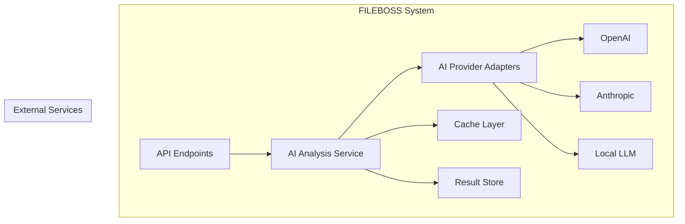
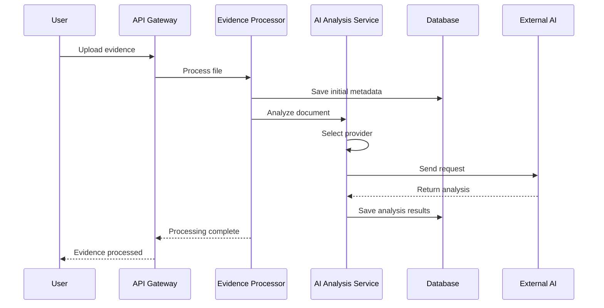
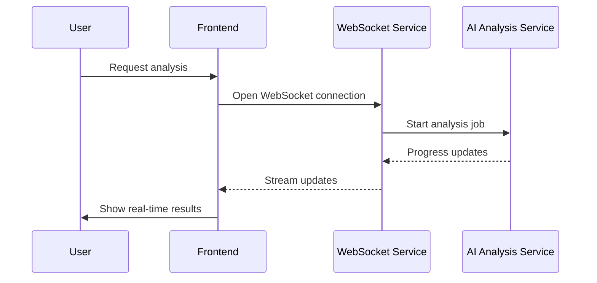

# AI Integration Architecture

## Overview
The AI Integration component of FILEBOSS provides advanced document analysis capabilities by leveraging multiple AI providers. This document outlines the architecture, components, and integration points for AI-powered features in the system.

## Architecture



## Components

### 1. AI Analysis Service

The main service that coordinates AI processing tasks:

- **Task Management**: Queues and manages AI processing tasks
- **Provider Selection**: Implements fallback and load balancing between providers
- **Result Processing**: Transforms and normalizes results from different providers
- **Caching**: Implements caching strategies to reduce costs and improve performance

### 2. AI Provider Adapters

Abstracts away differences between AI providers:

- **OpenAI Adapter**: For GPT-4, GPT-3.5, and other OpenAI models
- **Anthropic Adapter**: For Claude models
- **Local LLM Adapter**: For self-hosted models (e.g., LLaMA, Mistral)
- **Multi-Modal Adapter**: For vision and other non-text analysis

### 3. Cache Layer

- **In-Memory Cache**: For frequently accessed results
- **Permanent Storage**: For expensive-to-compute results
- **Vector Store**: For semantic search and similarity matching

### 4. Result Store

- **Structured Storage**: For analysis results
- **Versioning**: Tracks changes to analysis results
- **Audit Log**: Records all AI operations for compliance

## Integration Points

### 1. Evidence Processing Pipeline



### 2. Real-time Analysis

For interactive analysis features:



## AI Capabilities

### 1. Document Analysis

- **Text Extraction**: OCR and text recognition
- **Summarization**: Generate concise summaries
- **Key Points Extraction**: Identify main topics
- **Entity Recognition**: People, organizations, dates, etc.
- **Sentiment Analysis**: Tone and emotion detection
- **Classification**: Categorize documents

### 2. Evidence Processing

- **Redaction**: Automatic PII detection and redaction
- **Pattern Matching**: Identify relevant legal patterns
- **Cross-Reference**: Link related evidence
- **Timeline Generation**: Extract and order events

### 3. Legal-Specific Features

- **Precedent Matching**: Find similar cases
- **Legal Concept Extraction**: Identify legal principles
- **Compliance Checking**: Verify document compliance
- **Risk Assessment**: Evaluate case risks

## Provider Configuration

### OpenAI

```yaml
openai:
  api_key: ${OPENAI_API_KEY}
  default_model: gpt-4-turbo
  max_tokens: 4000
  temperature: 0.2
  timeout: 60
  rate_limit: 1000  # Requests per minute
```

### Anthropic

```yaml
anthropic:
  api_key: ${ANTHROPIC_API_KEY}
  default_model: claude-3-opus-20240229
  max_tokens: 4000
  temperature: 0.2
  timeout: 60
  rate_limit: 500  # Requests per minute
```

### Local LLM

```yaml
local_llm:
  enabled: true
  base_url: http://localhost:11434
  default_model: mistral
  max_tokens: 2000
  temperature: 0.2
  timeout: 120
```

## Rate Limiting and Cost Control

- **Per-User Quotas**: Limit AI usage per user/team
- **Cost Tracking**: Monitor and report AI costs
- **Priority Queuing**: Process high-priority tasks first
- **Budget Alerts**: Notify when approaching limits

## Security and Compliance

- **Data Minimization**: Only send necessary data to external providers
- **Encryption**: Encrypt data in transit and at rest
- **Audit Logging**: Log all AI operations
- **Consent Management**: Track user consent for AI processing
- **Data Retention**: Automatic cleanup of sensitive data

## Performance Considerations

1. **Caching Strategy**:
   - Cache frequent queries
   - Invalidate cache on document updates
   - Use semantic caching for similar queries

2. **Batch Processing**:
   - Process documents in batches when possible
   - Queue long-running tasks
   - Implement progress tracking

3. **Fallback Mechanisms**:
   - Fall back to simpler models when high-cost models fail
   - Implement circuit breakers for external services
   - Use local processing as fallback

## Monitoring and Observability

### Metrics to Track
- Response times by provider
- Success/failure rates
- Token usage and costs
- Cache hit/miss ratios
- Error rates by error type

### Logging
- All AI requests and responses (redacted)
- Performance metrics
- Cost and usage data
- Errors and warnings

## Example API Endpoints

### Analyze Document

```http
POST /v1/ai/analyze
Authorization: Bearer <token>
Content-Type: application/json

{
  "document_id": "550e8400-e29b-41d4-a716-446655440000",
  "analysis_type": "full",
  "options": {
    "include_summary": true,
    "extract_entities": true,
    "detect_sentiment": true
  },
  "priority": "high"
}
```

### Get Analysis Status

```http
GET /v1/ai/status/123e4567-e89b-12d3-a456-426614174000
Authorization: Bearer <token>
```

### List AI Models

```http
GET /v1/ai/models
Authorization: Bearer <token>
```

## Implementation Notes

1. **Error Handling**:
   - Implement retries with exponential backoff
   - Provide meaningful error messages
   - Log detailed error information

2. **Testing**:
   - Mock external services in unit tests
   - Test provider fallback behavior
   - Test rate limiting and error scenarios

3. **Scaling**:
   - Use async processing for long-running tasks
   - Implement horizontal scaling for high load
   - Use connection pooling for database access
