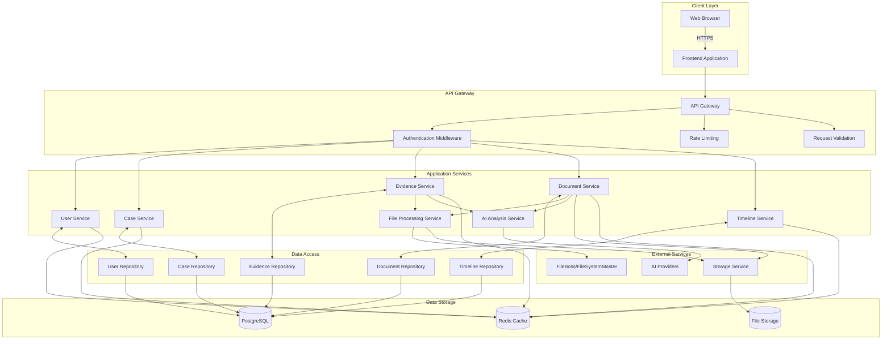

# FILEBOSS Component Diagram

## Component Descriptions

### Client Layer
- **Web Browser**: User interface for interacting with the application
- **Frontend Application**: Single Page Application (SPA) built with modern JavaScript framework

### API Gateway
- **Authentication Middleware**: Validates JWT tokens and enforces authorization
- **Rate Limiting**: Protects against abuse and DoS attacks
- **Request Validation**: Validates and sanitizes incoming requests

### Application Services
- **User Service**: Manages user accounts, authentication, and authorization
- **Case Service**: Handles case creation, updates, and management
- **Evidence Service**: Manages evidence items and their metadata
- **Document Service**: Handles document storage, retrieval, and versioning
- **Timeline Service**: Manages case timelines and events
- **AI Analysis Service**: Coordinates with external AI providers for document analysis
- **File Processing Service**: Handles file uploads, processing, and organization

### Data Access
- **Repositories**: Provide an abstraction layer over data storage
  - User Repository: User data and authentication
  - Case Repository: Case-related data
  - Evidence Repository: Evidence metadata and relationships
  - Document Repository: Document metadata and versions
  - Timeline Repository: Timeline events and relationships

### External Services
- **FileBoss/FileSystemMaster**: Advanced file processing and organization
- **AI Providers**: External AI services for document analysis (OpenAI, Anthropic, etc.)
- **Storage Service**: Manages file storage (local/cloud)

### Data Storage
- **PostgreSQL**: Primary relational database for structured data
- **File Storage**: For storing document and evidence files
- **Redis Cache**: For caching frequently accessed data and sessions

## Data Flow

1. **User Authentication**:
   - User logs in through the frontend
   - Credentials are validated by the User Service
   - JWT token is issued and stored client-side

2. **Case Management**:
   - Legal professionals create and manage cases
   - Case data is stored in PostgreSQL
   - Related documents and evidence are linked to cases

3. **Evidence Processing**:
   - Files are uploaded through the frontend
   - File Processing Service processes and stores files
   - Metadata is extracted and stored in the database
   - AI Analysis Service enriches metadata using external AI providers

4. **Document Management**:
   - Documents are versioned and stored
   - Access control is enforced at the API level
   - Document relationships are maintained

5. **Timeline Generation**:
   - Events are recorded as they occur
   - Timeline Service generates chronological views
   - Evidence and documents are linked to timeline events
