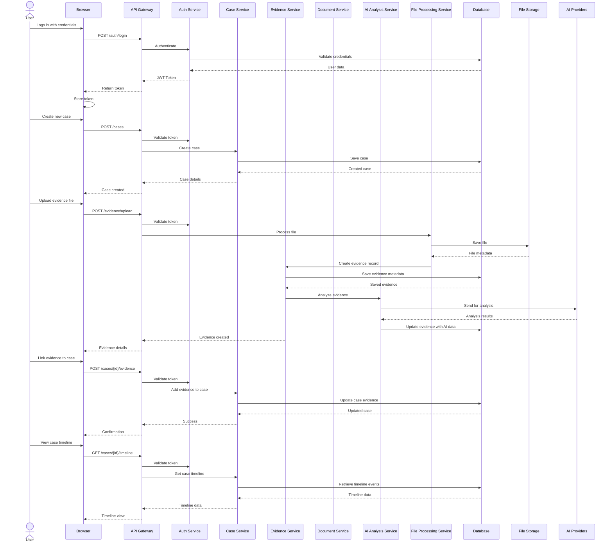

# FILEBOSS Data Flow Diagram

## Data Flow Descriptions

### 1. User Authentication
1. User submits login credentials
2. Credentials are validated against the database
3. JWT token is issued and returned to the client
4. Token is stored client-side for subsequent requests

### 2. Case Creation
1. User initiates new case creation
2. Request is authenticated and authorized
3. Case record is created in the database
4. Success response with case details is returned

### 3. Evidence Upload & Processing
1. User uploads an evidence file
2. File is processed by the File Processing Service
3. File is stored in the file storage system
4. Evidence metadata is saved to the database
5. File is sent to AI Analysis Service
6. AI analysis results are stored with the evidence
7. Confirmation is returned to the user

### 4. Evidence-Case Association
1. User links evidence to a case
2. Association is recorded in the database
3. Timeline events are updated
4. Confirmation is returned to the user

### 5. Timeline View
1. User requests case timeline
2. Timeline data is retrieved from the database
3. Events are ordered chronologically
4. Timeline view is rendered in the browser

## Data Storage Locations

| Data Type          | Storage Location       | Access Pattern                     |
|--------------------|------------------------|-----------------------------------|
| User Credentials  | Database (hashed)      | Read-heavy, write-occasionally    |
| Case Metadata     | Database               | Read/write balanced               |
| Evidence Metadata | Database               | Read/write balanced               |
| Document Content  | File Storage           | Write-once, read-many             |
| AI Analysis       | Database               | Write-once, read-many             |
| Session Data      | Redis Cache            | High-frequency read/write         |

## Performance Considerations

1. **Caching Strategy**:
   - Frequently accessed case and evidence metadata is cached in Redis
   - Cache invalidation on updates
   - Time-based expiration for volatile data

2. **File Processing**:
   - Asynchronous processing for large files
   - Chunked uploads for better reliability
   - Background tasks for resource-intensive operations

3. **Database Optimization**:
   - Indexes on frequently queried fields
   - Connection pooling for high concurrency
   - Read replicas for scaling read operations

4. **AI Processing**:
   - Queue-based processing for AI tasks
   - Rate limiting for external API calls
   - Fallback mechanisms for service unavailability
