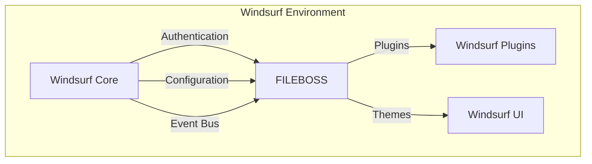
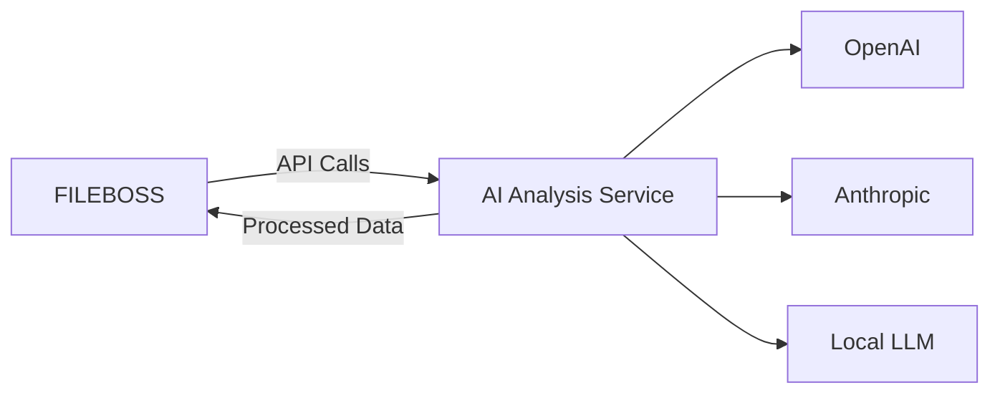
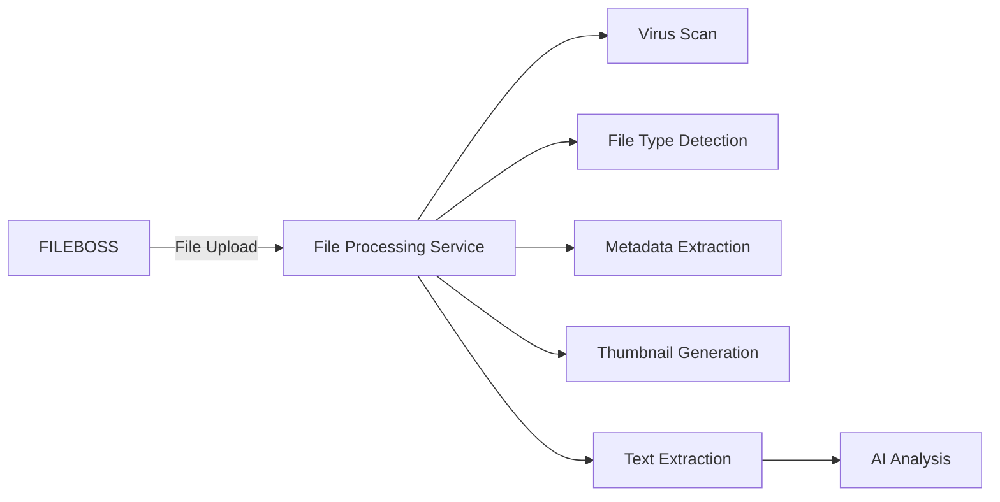
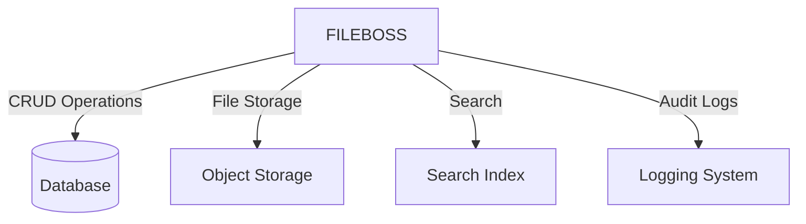
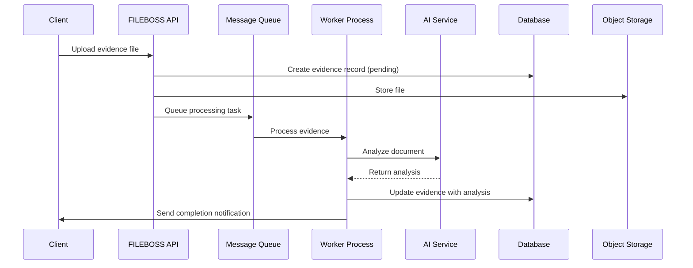
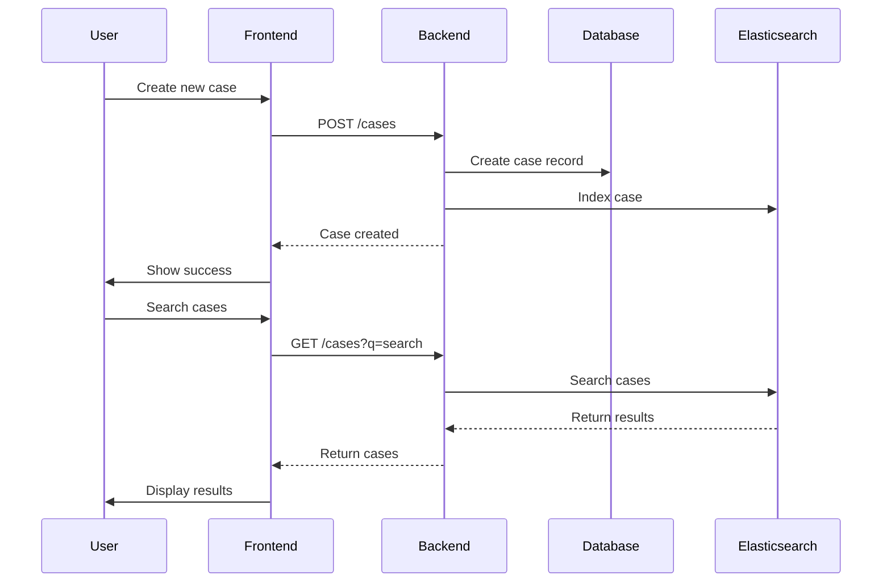
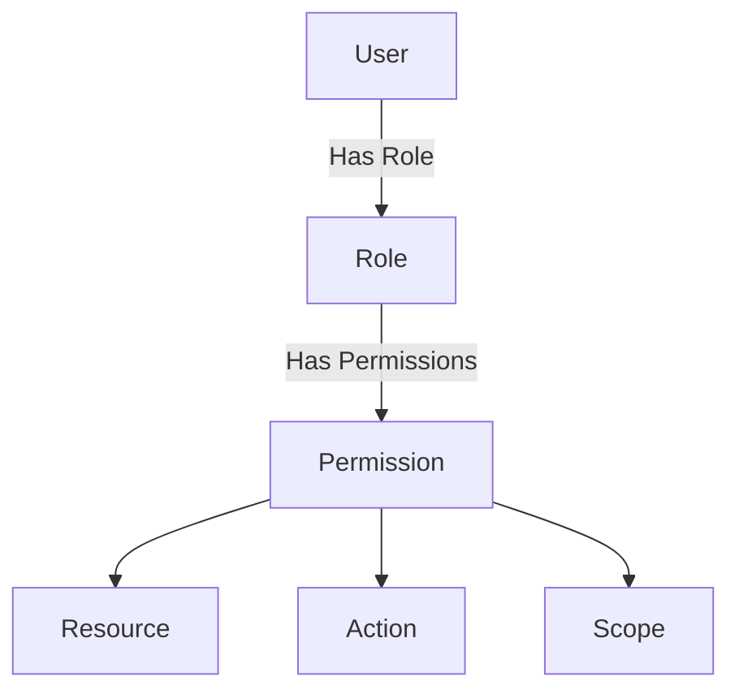

# Integration Points

## Overview
This document outlines the key integration points between FILEBOSS and other systems in the Windsurf environment. It covers how different components interact, data flows between them, and the technologies used for integration.

## Table of Contents
1. [System Integration Points](#system-integration-points)
2. [Data Flow Between Systems](#data-flow-between-systems)
3. [API Specifications](#api-specifications)
4. [Authentication & Authorization](#authentication--authorization)
5. [Error Handling & Monitoring](#error-handling--monitoring)
6. [Deployment & Configuration](#deployment--configuration)

## System Integration Points

### 1. Windsurf Core Integration



**Key Integration Points:**
- **Authentication**: Uses Windsurf's OAuth2/OpenID Connect for single sign-on
- **Configuration**: Loads settings from Windsurf's configuration management
- **Event System**: Publishes/subscribes to system-wide events
- **Plugin System**: Extends functionality through Windsurf plugins
- **Theming**: Follows Windsurf's theming system for consistent UI

### 2. AI Service Integration



**Key Integration Points:**
- **REST API**: Standardized API for AI service communication
- **WebSockets**: For real-time updates on long-running AI tasks
- **Fallback Mechanism**: Automatic fallback between AI providers
- **Rate Limiting**: To manage API quotas and costs

### 3. File Processing Pipeline



**Key Integration Points:**
- **Asynchronous Processing**: Using message queues (Redis/RabbitMQ)
- **Modular Processors**: Pluggable architecture for different file types
- **Progress Tracking**: Real-time updates on processing status
- **Error Handling**: Automatic retries and error reporting

### 4. Evidence Management System



**Key Integration Points:**
- **Database**: PostgreSQL for structured data
- **Object Storage**: S3-compatible storage for files
- **Search**: Elasticsearch for full-text and faceted search
- **Audit Logging**: Centralized logging with metadata

## Data Flow Between Systems

### 1. Evidence Upload Flow



### 2. Case Management Flow



## API Specifications

### 1. Internal Service API

**Base URL**: `http://fileboss-service:8000`

| Endpoint | Method | Description | Authentication |
|----------|--------|-------------|----------------|
| `/api/v1/evidence` | POST | Create new evidence | JWT |
| `/api/v1/evidence/{id}` | GET | Get evidence details | JWT |
| `/api/v1/cases` | GET | List cases | JWT |
| `/api/v1/cases` | POST | Create case | JWT |
| `/api/v1/ai/analyze` | POST | Analyze document | Service Token |

### 2. Webhook Endpoints

| Endpoint | Method | Description | Authentication |
|----------|--------|-------------|----------------|
| `/webhooks/ai-callback` | POST | AI processing results | HMAC |
| `/webhooks/file-processed` | POST | File processing updates | HMAC |

## Authentication & Authorization

### 1. Authentication Methods

- **JWT (Users)**: For API access from the frontend
- **Service Accounts**: For service-to-service communication
- **API Keys**: For external integrations
- **OAuth 2.0**: For third-party application access

### 2. Authorization Model



**Example Roles:**
- `admin`: Full system access
- `attorney`: Case management, evidence review
- `paralegal`: Evidence upload, basic case access
- `reviewer`: Read-only access to assigned cases

## Error Handling & Monitoring

### 1. Error Responses

All error responses follow this format:

```json
{
  "error": {
    "code": "error_code",
    "message": "Human-readable message",
    "details": {},
    "request_id": "req_12345"
  }
}
```

### 2. Monitoring Integration

- **Metrics**: Prometheus metrics endpoint at `/metrics`
- **Logging**: Structured JSON logs to stdout
- **Tracing**: OpenTelemetry for distributed tracing
- **Alerts**: Configured in Windsurf monitoring

## Deployment & Configuration

### 1. Environment Variables

| Variable | Required | Default | Description |
|----------|----------|---------|-------------|
| `DATABASE_URL` | Yes | - | PostgreSQL connection string |
| `REDIS_URL` | Yes | - | Redis connection URL |
| `STORAGE_BUCKET` | Yes | - | S3-compatible storage bucket |
| `AI_PROVIDER` | No | `openai` | Default AI provider |
| `LOG_LEVEL` | No | `info` | Logging level |

### 2. Helm Chart Values

```yaml
replicaCount: 2

image:
  repository: fileboss/api
  tag: latest
  pullPolicy: IfNotPresent

service:
  type: ClusterIP
  port: 8000

ingress:
  enabled: true
  className: nginx
  annotations:
    nginx.ingress.kubernetes.io/ssl-redirect: "true"
  hosts:
    - host: fileboss.example.com
      paths:
        - path: /
          pathType: Prefix

autoscaling:
  enabled: true
  minReplicas: 2
  maxReplicas: 10
  targetCPUUtilizationPercentage: 80

resources:
  limits:
    cpu: 1000m
    memory: 2Gi
  requests:
    cpu: 200m
    memory: 512Mi
```

### 3. CI/CD Pipeline


## Security Considerations

1. **Data Encryption**
   - TLS 1.3 for all communications
   - Encryption at rest for sensitive data
   - Key management through Windsurf Vault

2. **Access Control**
   - Principle of least privilege
   - Role-based access control (RBAC)
   - Audit logging of all sensitive operations

3. **Compliance**
   - GDPR/CCPA compliance for personal data
   - Retention policies for audit logs
   - Regular security audits

## Performance Considerations

1. **Caching Strategy**
   - Redis for session and query caching
   - HTTP caching headers for static assets
   - Database query optimization

2. **Scaling**
   - Horizontal scaling of stateless services
   - Read replicas for database
   - Sharding for large datasets

3. **Monitoring**
   - Real-time performance metrics
   - Alerting on error rates and latency
   - Capacity planning based on usage trends
