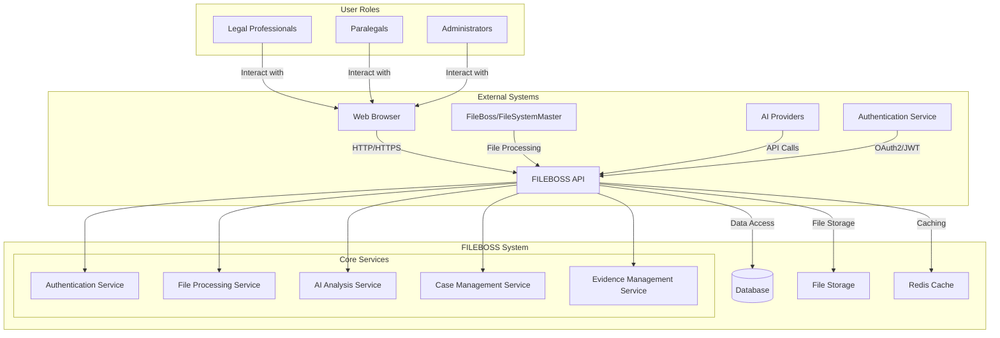

# FILEBOSS System Context

## Key Components

1. **External Systems**
   - **Web Browser**: Primary interface for users
   - **FileBoss/FileSystemMaster**: File processing and organization
   - **AI Providers**: External AI services for document analysis
   - **Authentication Service**: Handles user authentication and authorization

2. **Core FILEBOSS System**
   - **API Layer**: FastAPI-based RESTful endpoints
   - **Database**: PostgreSQL for structured data storage
   - **File Storage**: Local/cloud storage for documents and evidence
   - **Redis Cache**: For performance optimization
   - **Core Services**: Modular services for different business domains

3. **User Roles**
   - **Legal Professionals**: Primary users managing cases and evidence
   - **Paralegals**: Support staff assisting with case preparation
   - **Administrators**: System administrators managing users and settings

## Data Flow

1. Users interact with the system through a web browser
2. Requests are authenticated and authorized
3. Business logic is processed by the appropriate service
4. Data is persisted to the database and/or file storage
5. Responses are returned to the user
6. External services are integrated as needed for file processing and AI analysis
